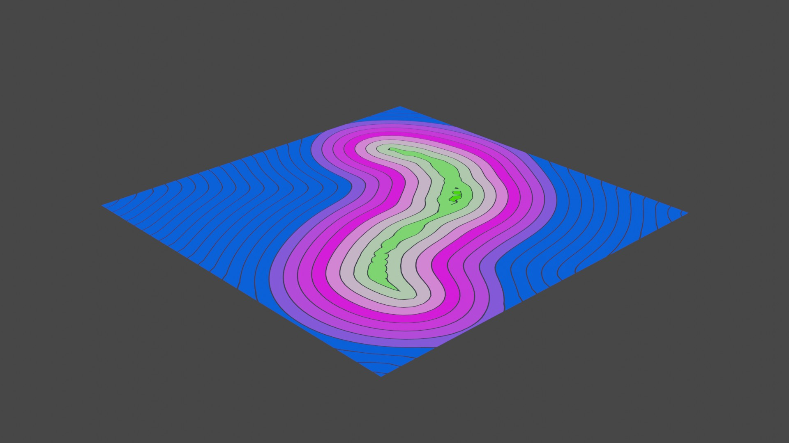
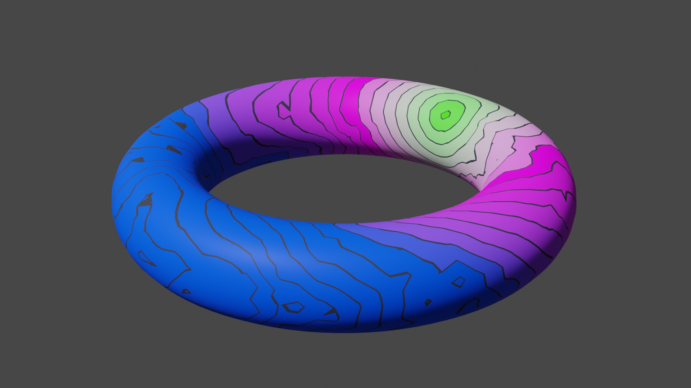
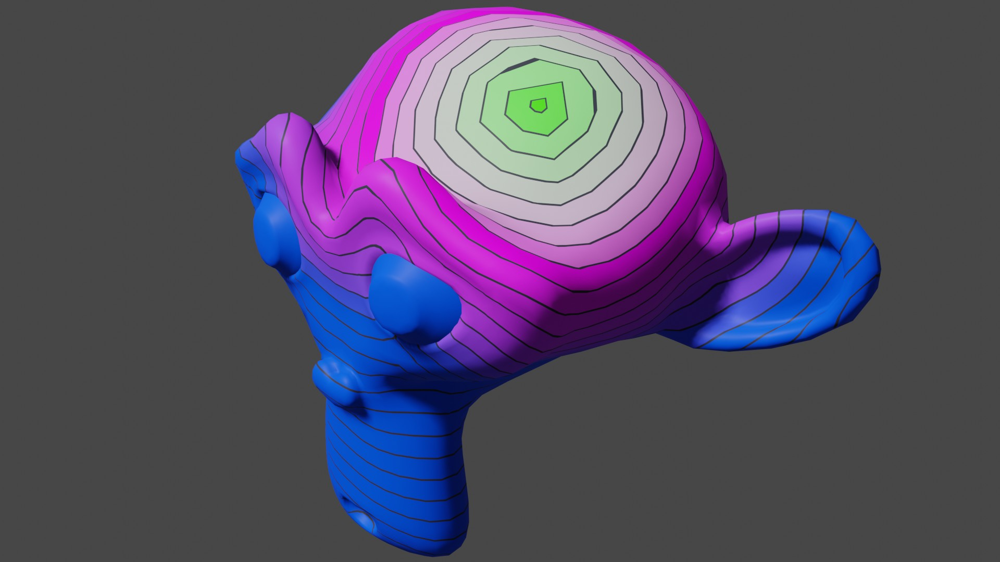
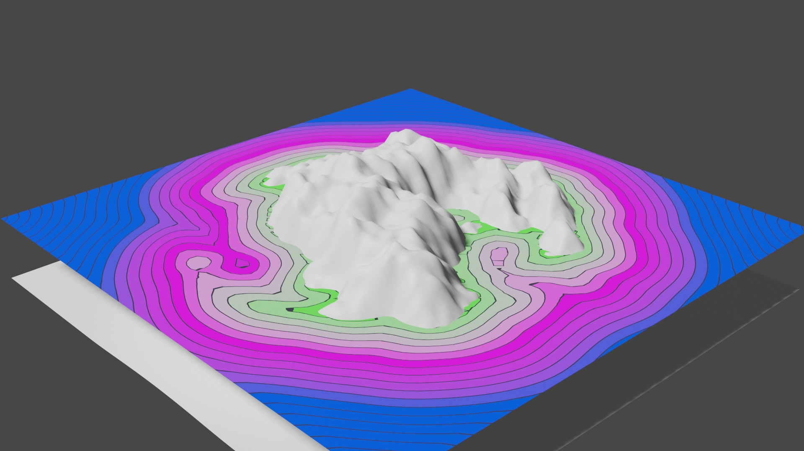
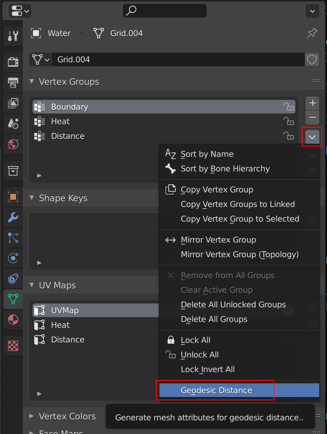

# GeoDoodle

Geodesic distance computation for Blender meshes

## Table of Contents
1. [Overivew](#overview)
2. [Usage](#usage)
3. [Implementation](#implementation)

## Overview

This addon provides an operator for computing geodesic distances on general meshes (ngons and triangular).

Geodesic distance describes a shortest path from any point on the surface to some source, e.g. a selected vertex. It can differ from simple Euclidian distance significantly.

|||
|---|---|
|  |  |
|  |  |

## Prerequisites

The addon uses the [SciPy](https://scipy.org/) math library for efficient sparse matrix computations.

SciPy is not shipped with the Python installation in Blender, so you may need to install the package once.
A convenient method is to use the text editor.

**Note: You may need to run Blender in administrator mode for permissions to install into the packages folder!**

1. Open Blender.
1. Open a text editor window and create a new text.
1. Paste in the following code and execute the script:

   ```
   import sys
   import subprocess
   
   py_exec = sys.executable
   py_prefix = sys.exec_prefix
   # ensure pip is installed & update
   subprocess.call([str(py_exec), "-m", "ensurepip", "--user"])
   subprocess.call([str(py_exec), "-m", "pip", "install", "--target={}".format(py_prefix), "--upgrade", "pip"])
   # install dependencies using pip
   # dependencies such as 'numpy' could be added to the end of this command's list
   subprocess.call([str(py_exec),"-m", "pip", "install", "--target={}".format(py_prefix), "scipy"])
   ```

   Source: https://blender.stackexchange.com/a/153520

## Usage

1. Create a mesh object.
2. Add a source vertex group. The default name should be "Source", although the operator can work with arbitrary vertex groups.

   Procedurally generated vertex groups are also supported (e.g. with a proximity modifier). However, topology modifiers such as subdivision are not recommended because the operator will copy the modifier result to the base mesh.

3. Select the mesh object.
4. Invoke the _Geodesic Distance_ operator from the dropdown next to the vertex group list.

   

## Implementation

The implementation is based on the _Heat Method_ as described by Crane et al. <sup>[1](#CWW13)</sup>. The Laplacian for polygonal meshes is described in the paper _"Polygon laplacian made simple"_ <sup>[2](#BHKB20)</sup>.

<a id="CWW13">1</a>: Crane, Keenan, Clarisse Weischedel, and Max Wardetzky. "Geodesics in heat: A new approach to computing distance based on heat flow." ACM Transactions on Graphics (TOG) 32.5 (2013): 1-11.

<a id="BHKB20">2</a>: Bunge, Astrid, et al. "Polygon laplacian made simple." Computer Graphics Forum. Vol. 39. No. 2. 2020.