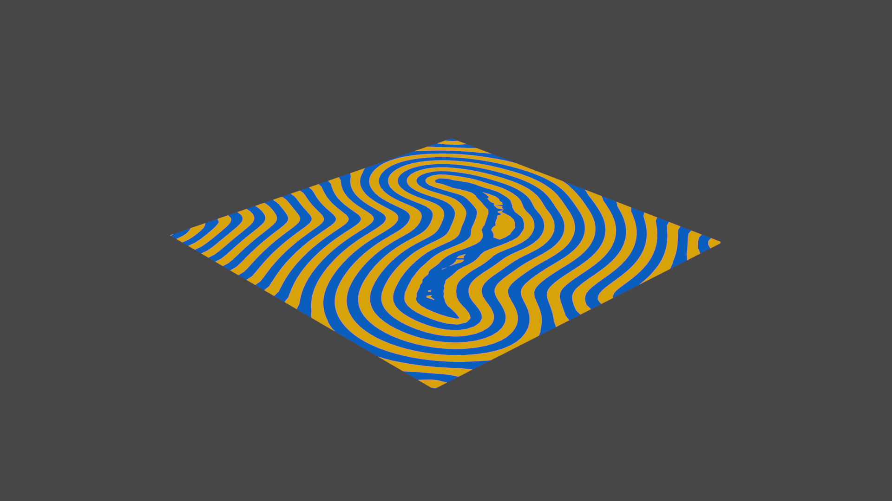
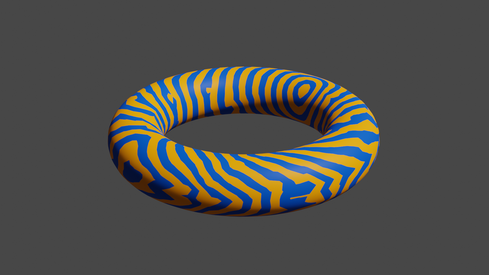
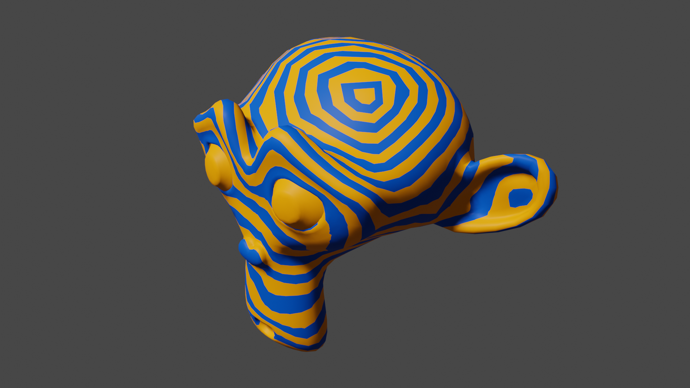
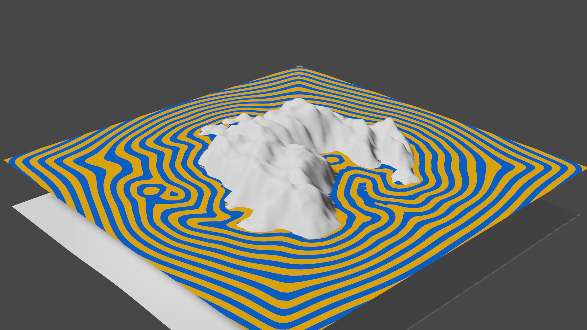

# GeoDoodle

Geodesic distance computation for Blender meshes

## Table of Contents
1. [Overivew](#overview)
2. [Usage](#usage)
3. [Implementation](#implementation)

## Overview

This addon provides an operator for computing geodesic distances on general meshes (ngons and triangular).

Geodesic distance describes a shortest path from any point on the surface to some boundary, e.g. a selected vertex. It can differ from simple Euclidian distance significantly.

|||
|---|---|
|  |  |
|  |  |

## Usage

1. Create a mesh object.
2. Add a boundary vertex group. The default name should be "Boundary", although the operator can work with arbitrary vertex groups.

   If the vertex group is generated procedurally with a modifier, make sure to apply the modifier so the vertex group becomes part of the mesh data.

3. Select the mesh object.
4. Invoke the _Geodesic Distance_ operator from the dropdown next to the vertex group list.

   

## Implementation

The implementation is based on the _Heat Method_ as described by Crane et al. [1](#CWW13). The Laplacian for polygonal meshes is described in the paper _"Polygon laplacian made simple"_ [2](#BHKB20).

<a id="CWW13">1</a>: Crane, Keenan, Clarisse Weischedel, and Max Wardetzky. "Geodesics in heat: A new approach to computing distance based on heat flow." ACM Transactions on Graphics (TOG) 32.5 (2013): 1-11.

<a id="BHKB20">2</a>: Bunge, Astrid, et al. "Polygon laplacian made simple." Computer Graphics Forum. Vol. 39. No. 2. 2020.